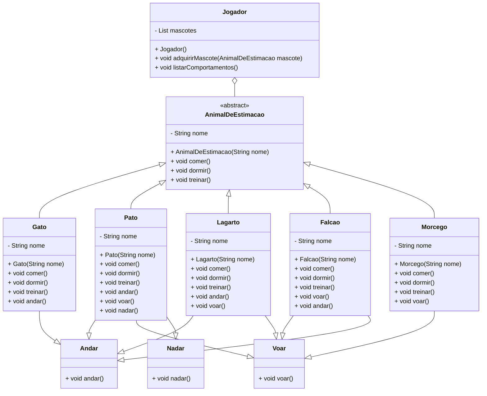

# Treine seu Animal de Estimação para o RPG

## Descrição

Este projeto implementa um sistema para treinar animais de estimação para colaborar em jogos, como RPGs ou RMPGs. Cada animal possui comportamentos específicos de acordo com seu tipo (pássaro, mamífero, réptil) e pode ser adquirido por um jogador para auxiliar em suas aventuras.

## Estrutura do Projeto

### Diagrama de Classes



### Classes e Interfaces

#### `AnimalDeEstimacao`

Classe abstrata que define métodos para comportamentos básicos de todos os animais de estimação:
- `comer()`: Para o animal comer.
- `dormir()`: Para o animal dormir.
- `treinar()`: Para treinar o animal.

#### Interfaces para Comportamentos

- `Andar`: Define o método `andar()`.
- `Voar`: Define o método `voar()`.
- `Nadar`: Define o método `nadar()`.

#### Classes para Tipos de Animais

- `Gato`: Mamífero que implementa `Andar`.
- `Pato`: Ave que implementa `Andar`, `Voar` e `Nadar`.
- `Lagarto`: Réptil que implementa `Andar` e `Voar`.
- `Falcao`: Ave de rapina que implementa `Voar` e `Andar`.
- `Morcego`: Mamífero que implementa `Voar`.

#### Classe `Jogador`

Classe que representa o jogador, responsável por adquirir e gerenciar os animais de estimação:
- `adquirirMascote(AnimalDeEstimacao mascote)`: Adquire um novo animal de estimação.
- `listarComportamentos()`: Lista os comportamentos aprendidos pelos animais adquiridos.

## Exemplo de Uso

```java
public class Main {
    public static void main(String[] args) {
        Jogador jogador = new Jogador();

        AnimalDeEstimacao m1 = new Gato("Gato");
        AnimalDeEstimacao m2 = new Pato("Pato");
        AnimalDeEstimacao m3 = new Lagarto("Lagarto");
        AnimalDeEstimacao m4 = new Falcao("Falcão");
        AnimalDeEstimacao m5 = new Morcego("Morcego");

        jogador.adquirirMascote(m1);
        jogador.adquirirMascote(m2);

        System.out.println("O jogador tem os seguintes mascotes:");
        jogador.listarComportamentos();
    }
}
```

### Saída Esperada

```
O jogador tem os seguintes mascotes:
Comportamento de Gato: pode andar 
Comportamento de Pato: pode andar pode voar pode nadar 
```

## Contribuição

Contribuições são bem-vindas! Sinta-se à vontade para abrir uma _issue_ ou enviar um _pull request_.

## Licença

Este projeto está licenciado sob a Licença MIT. Veja o arquivo [LICENSE](LICENSE) para mais detalhes.